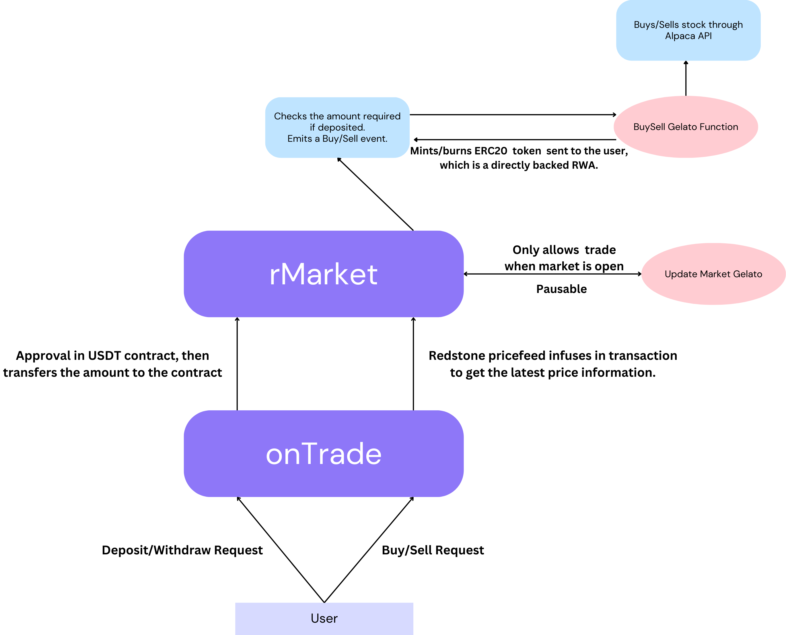

# onTrade

### Directly Backed Trading On-Chain: Real Assets, Real Security

Our project addresses a crucial gap in the current landscape of De-Fi on the blockchain. Traditional synthetic RWAs only mint tokens based on price feeds, creating an abstraction layer that does not connect directly to the underlying assets. Our solution takes a more direct approach by enabling RWAs that are directly backed by real assets.

By utilizing Gelato functions, our platform executes stock purchases off-chain, ensuring that the tokens you hold are genuinely backed by real stocks on the market. This enhances trust, transparency, and the overall value proposition of RWAs on-chain, effectively bridging the gap between traditional finance and blockchain technology.

#### Currently Deployed on EDUChain Sepolia and Supports the Following Stocks:
- [AAPL](https://edu-chain-testnet.blockscout.com/address/0xB565656a18bd287A28C6aBEBBcbBDB54DDe37eeb)
- [AMZN](https://edu-chain-testnet.blockscout.com/address/0xD5c035A6e65F3F1445aCA33C531b2545a0D3d744)
- [NASDAQ](https://edu-chain-testnet.blockscout.com/address/0xDD7e4D53570E998446576C1FFb3c53D2E9b5139f)
- [S&P500](https://edu-chain-testnet.blockscout.com/address/0x6Cc97B5BfE61d1B985D80a71fB785e35933148a0)

#### The flow of the Dapp is as follows:-
- Approve and deposit the suffcient amount of USDT to the contract.
- Select the stock and the correct amount.
- Redstone's core price feed wraps the transaction with its oracle data.
- After calling the `buyRStock` function, a `BuyRequest` gets emmitted.
- The event is picked up by Gelato's web3-function, which calls the Alpaca API to buy the respective stock in the exchange.
- It then excutes the `mintRStock` function, which mints the directly backed ERC20 of the RWA on-chain.
- In a similar manner, it can be sold and the USDT can be withdrawn. 



This repository includes the contract and Web3 functions, which need to be deployed separately for testing.

### For Contract:
```
$ forge init // Move the contract to foundry directory
$ forge install redstone-finance/redstone-oracles-monorepo --no-commit
$ forge install OpenZeppelin/openzeppelin-contracts@v4.9.5 --no-commit
```

### For web3-function
```
$ git clone https://github.com/gelatodigital/web3-functions-sdk.git
// Move the stocks and updates folder to web3-function
$ npx hardhat w3f-deploy stocks // to get the typescript function IPFS CID
```

### For web-app
```
$ npm i
$ npm run dev
```


### Environment Variables:
Environment variables are needed for Web3 functions as they use the [Alpaca API](https://app.alpaca.markets/signup) for stock trading.

#### Gelato Deployed Functions:
- [MarketAAPL](https://app.gelato.network/functions/task/0xc2330bd6287ef7b31e264c82eae4de56c1afb39ef023fd5c3de6f90fcd13fa24:656476)
- [BuyAAPL](https://app.gelato.network/functions/task/0x023c484f869685f8b97a5bf7a4ce491ec55e966dccf78f5de0d5adc69371ce7d:656476)
- [SellAAPL](https://app.gelato.network/functions/task/0xf80d647129ca02ce3dc484fbdbbb5bf8cd49892f4846e6c7c1527ab7038de3e8:656476)
- [MarketAMZN](https://app.gelato.network/functions/task/0x342428a2c9e1f5130e01ab0efe3fc2cbedff5ec16fe48441f768def597515ed6:656476)
- [BuyAMZN](https://app.gelato.network/functions/task/0xa41b9647a8973820bce93e500c3278470039f9e659ecd5a2b7db2a7966e6d88c:656476)
- [SellAMZN](https://app.gelato.network/functions/task/0x2ffd2c2ec9043eda23a75e9ba2a9c14da3aceee319eed17681950c9fdaae090a:656476)
- [MarketNASDAQ](https://app.gelato.network/functions/task/0x664663e7676e0fda75a10bd890f957cf9038db9ebe42af793384ef700a48397a:656476)
- [BuyNDAQ](https://app.gelato.network/functions/task/0x90b216944a461cec86cb022238429ae89c0ab851e8adfd8ee361567fcfb6623f:656476)
- [SellNDAQ](https://app.gelato.network/functions/task/0xbcc59aa585d10bb34f1d01d37bb92a0ed128ed430918ada9d6153ecc50cc48f4:656476)
- [MarketSPY](https://app.gelato.network/functions/task/0x0c612f9ac789ca7e9417a2ad11430252b9dadff4ae623ad7703fdb82d1c074b0:656476)
- [BuySPY](https://app.gelato.network/functions/task/0x8262f92d7dc54ebc72f7b00ecc442ebcb5fa3d82b6ad56426dbb405e9e9e384b:656476)
- [SellSPY](https://app.gelato.network/functions/task/0xcfa6a7d0c64fcbda34069194d4ccbae72552d67f0718584acfe14a510e56309e:656476)

- **Market Function**: Manages pausing and unpausing of the contract based on market status.
- **Buy Function**: Listens for `BuyRequest` events, interacts with the Alpaca API to purchase stock, and mints the corresponding ERC20 token to the trader.
- **Sell Function**: Listens for `SellRequest` events, interacts with the Alpaca API to sell stock, and burns the corresponding ERC20 token from the trader.

### [Demo Video]()

## Built during EDUChain X Hackquest Mega Co-Learning Camp - Bangalore
